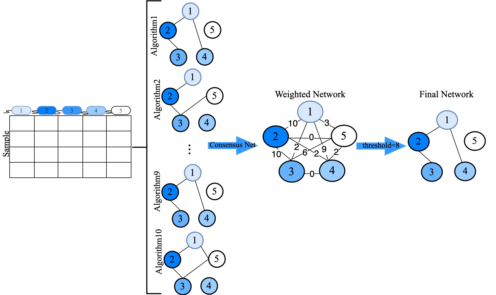
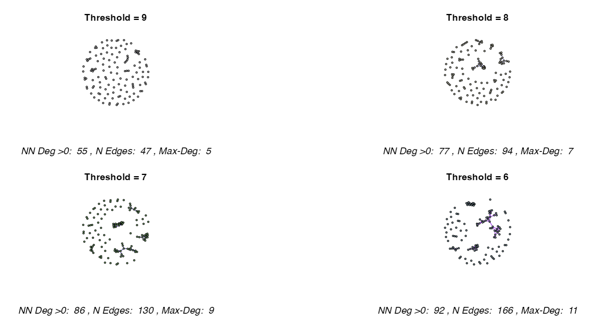

# CMiNetShinyAPP


[](https://github.com/solislemuslab/CMiNetShinyAPP/blob/main/LICENSE)
[](https://github.com/solislemuslab/CMiNetShinyAPP/issues)

[](https://github.com/solislemuslab/CMiNetShinyAPP/releases)


## Description
<div align="justify">
CMiNetShinyApp is a Shiny application designed to construct consensus microbiome networks by integrating results from multiple network construction algorithms. Tailored specifically for microbiome data, this tool captures the intricate relationships between microbial taxa, offering insights into complex biological systems and their impacts on health and disease.

The CMiNetShinyApp incorporates a variety of established algorithms, including Pearson and Spearman correlation, Biweight midcorrelation, Sparse Correlations for Compositional data (SparCC), Sparse InversE Covariance estimation for Ecological Association and Statistical Inference (SpiecEasi), Semi-Parametric Rank-based Correlation and Partial Correlation Estimation (SPRING), Generalized Co-Occurrence Differential Abundance analysis (gCoda), Correlation Inference for Compositional Data through Lasso (CCLasso), and a novel algorithm based on conditional mutual information (CMIMN). These algorithms generate individual microbial association networks, which CMiNet combines into a single, weighted consensus network. By integrating the strengths of each method, CMiNet delivers a robust and comprehensive representation of microbial interactions.
</div>


## Table of Contents
- [Methods Included in CMiNetShinyApp](#Methods-Included-in-CMiNetShinyApp)
- [CMiNet Shiny App](#CMiNet-Shiny-App)
- [Source Code](#Source-Code)
- [Important Setup Information](#Important-Setup-Information)
  - [Running the web apps locally](#Running-the-web-apps-locally)
- [CMiNet ShinyApp Sample Data](#CMiNet-ShinyApp-Sample-Data)
  - [Define the parameter on all Algorithms](#Define-the-parameter-on-all-Algorithms)


## Methods Included in CMiNet ShinyAPP
CMiNet ShinyAPP employs a range of established algorithms to construct individual microbial association networks, including:
- Pearson coefficient (cor() from stats package)
- Spearman coefficient (cor() from stats package)
- Biweight Midcorrelation (bicor() from WGCNA package)
- SparCC ([R code on GitHub](https://github.com/huayingfang/CCLasso/blob/master/R/SparCC.R))
- CCLasso ([R code on GitHub](https://github.com/huayingfang/CCLasso/tree/master))
- SpiecEasi ([SpiecEasi package](https://github.com/zdk123/SpiecEasi))
- SPRING ([SPRING package](https://github.com/GraceYoon/SPRING))
- CMIMN ([CMIMN package](https://github.com/solislemuslab/CMIMN))
- gCoda ([R code on GitHub](https://github.com/huayingfang/gCoda))

CMiNet combines these networks into a single, weighted consensus network, leveraging the strengths of each method to provide a comprehensive and reliable representation of microbial interactions.

## CMiNet Shiny App
The CMiNet Shiny App simplifies the process of constructing, visualizing, and analyzing microbiome networks. It includes the following features:
- CMiNet: Construct a weighted network, select algorithms, and download results.
- Visualization: This visualization compares network structures based on four different thresholds. Below each network depicts the number of nodes with degree > 0 (NN Deg >0), the number of edges (N Edges), and the maximum degree value in the network (Max-Deg).
- Final Network: Explore the final network based on user-defined thresholds.
- About: Access detailed information about running and interpreting CMiNet results.

## Source Code
CMiNetShinyApp  is an open source project, and the source code is available at in this repository with the main web app code in app.R.

### Running the web apps locally
Users with strong programming skills might like to  run a version of the web apps locally.

The first step is to download the code. You can do this with git:
```bash
git clone https://github.com/solislemuslab/CMiNetShinyAPP.git
```

Make sure you have the dependencies installed. You can use the following command in R to install all the package dependencies:

```bash
install.packages("devtools")
devtools::install_github("solislemuslab/CMiNet")
```
If there are any errors during installation, please install the missing dependencies manually.
In particular the automatic installation of SPRING and SpiecEasi (only available on GitHub) does sometimes not work. These packages can be installed as follows (the order is important because SPRING depends on SpiecEasi):
```bash
devtools::install_github("zdk123/SpiecEasi@v1.1.1")
devtools::install_github("GraceYoon/SPRING")
if (!requireNamespace("BiocManager", quietly = TRUE))
    install.packages("BiocManager")
BiocManager::install(c("AnnotationDbi", "GO.db", "preprocessCore", "impute"))
library(AnnotationDbi)
library(GO.db)
library(preprocessCore)
library(impute)
library(SpiecEasi)
library(SPRING)
```
Other Dependecy

```bash
list.of.packages <- c(
  "shiny", 
  "shinyWidgets", 
  "shinyBS",
  "igraph",
  "tidyverse",
  "visNetwork")
new.packages <- list.of.packages[!(list.of.packages %in% installed.packages()[, "Package"])]
if(length(new.packages)) install.packages(new.packages)

We recommend run it in the downloaded CMiNet_shinyapp.Rproj project: 
shiny::runApp()
```


## CMiNet ShinyApp Sample Data

The CMiNet ShinyApp includes a sample dataset from the American Gut Project (available via the SpiecEasi package) to demonstrate its functionality. You can download this Sample Gut Microbiome Dataset to explore the required data format.
Additionally, the Weighted Gut Microbiome Network generated by CMiNet using this sample data is available for download, allowing you to examine the output and functionality of the tool in detail.

### Define the parameter on all Algorithms
The CMiNet ShinyApp enables users to customize the default parameters of each algorithm to suit their specific research needs and preferences. Below is a list of parameters for the various algorithms, pre-configured with default settings, which can be adjusted as needed.
- sparcc_params = list(imax = 20, kmax = 10, alpha = 0.1, Vmin = 1e-4)
- spiecEasi_mb_params= list(method = 'mb', lambda.min.ratio = 1e-2, nlambda = 15, pulsar.params = list(rep.num = 20, ncores = 4))
- spiecEasi_glasso_params =params = list(method = 'glasso', lambda.min.ratio = 1e-2, nlambda = 15, pulsar.params = list(rep.num = 50), ncores = 4))
- spring_params = list(Rmethod = "original", quantitative = TRUE, ncores = 5, lambdaseq = "data-specific", nlambda = 15, rep.num = 20)
- gcoda_params = list(counts = FALSE, pseudo = 0.5, lambda.min.ratio = 1e-4, nlambda = 15, ebic.gamma = 0.5)
- c_MI_params = list(quantitative = TRUE, q1 = 0.7, q2 = 0.95)
- cclasso_params = list(counts = FALSE, pseudo = 0.5, k_cv = 3, lam_int = c(1e-4, 1), k_max = 20, n_boot = 20)

## Sample Data Result from CMiNet ShinyApp
The following figure represents the result of running the CMiNet ShinyApp on the sample dataset. This visualization was generated using the Visualization Tab, showcasing the weighted microbiome network constructed from the sample data. The figure illustrates the intricate microbial associations derived from the consensus network methodology.



## Reporting Issues and Asking Questions

If you encounter a bug, experience a failed function, or have a feature request, please open an issue in the GitHub [issue tracker](https://github.com/solislemuslab/CMiNetShinyAPP/issues). 

## License

CMIMN is licensed under the [GNU General Public License v3.0 (GPL-3)](https://www.gnu.org/licenses/gpl-3.0.html). &copy; Solis-Lemus Lab (2024).


## Citation

If you use CMiNet in your work, we kindly ask that you cite the following paper:

```bibtex
@article{aghdam2024,
  year = {2024},
  publisher = {In process},
  author = {Rosa Aghdam, Shan Shan, Richard Lankau and Claudia Solis-Lemus},
  title = {Leveraging Machine Learning and Enhanced Network-based methods in Potato Disease Interactions}
}
@article{aghdam2024_2,
  year = {2024},
  publisher = {In process},
  author = {Rosa Aghdam and Claudia Solis-Lemus},
  title = {CMiNet: R package for learning the Consensus Microbiome Network}
} 
```
